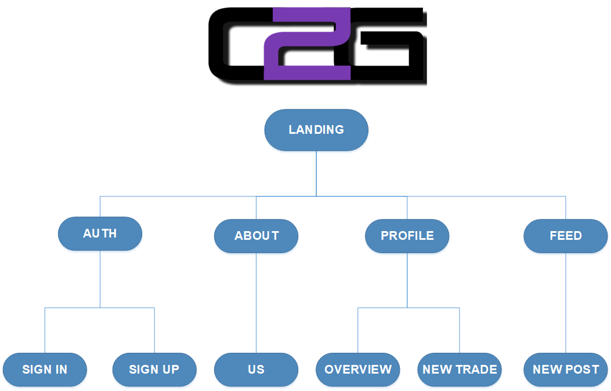
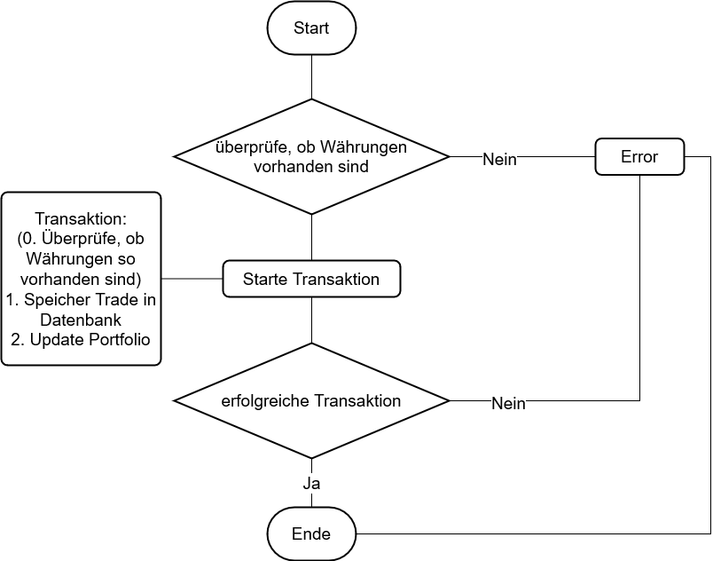
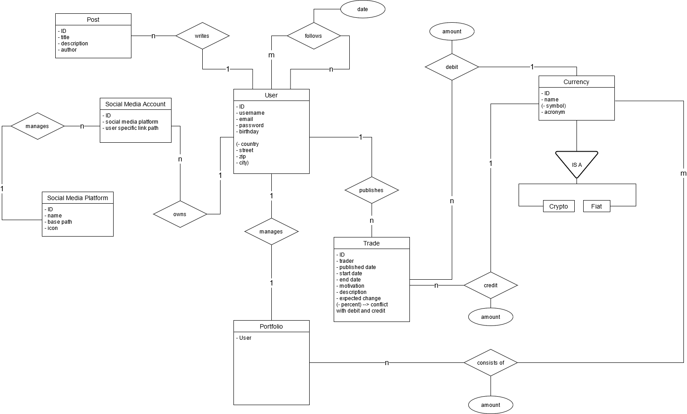
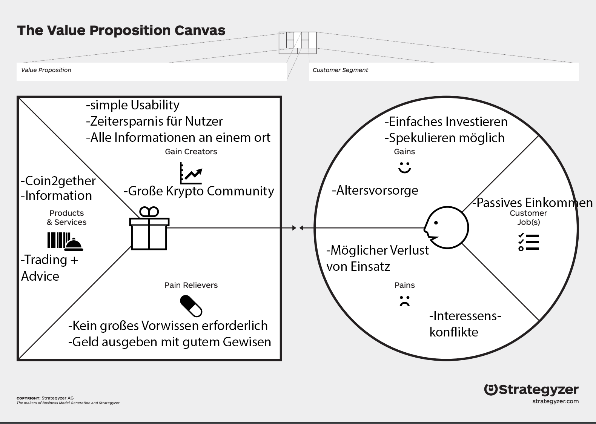
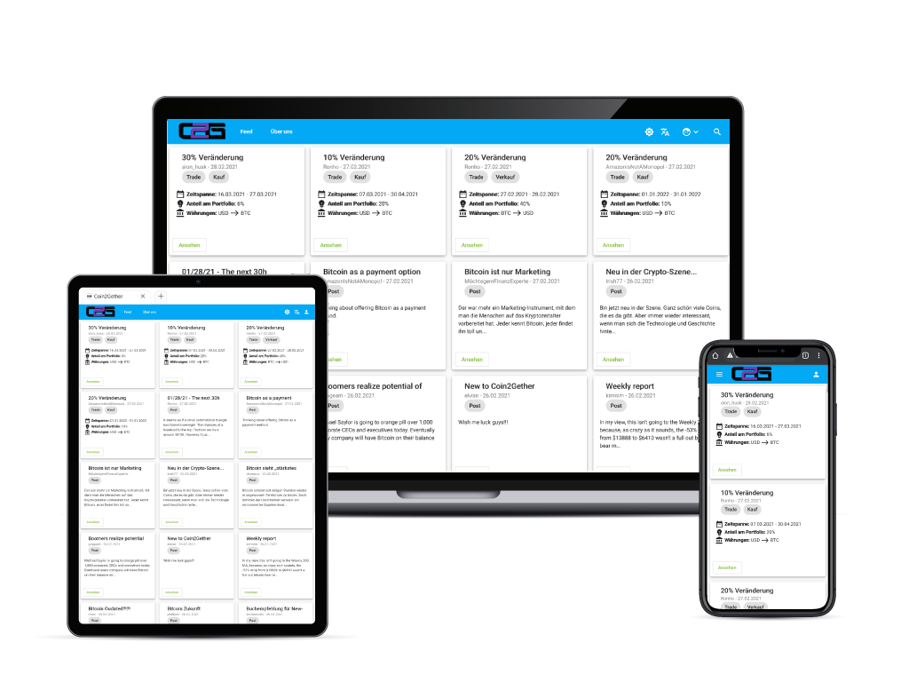
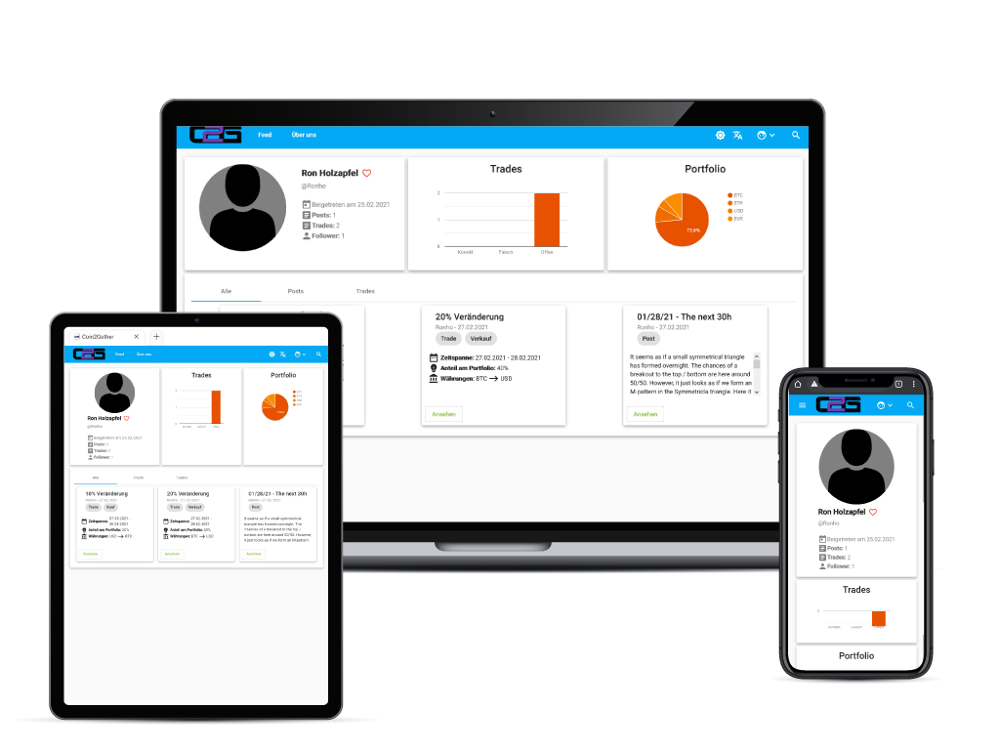
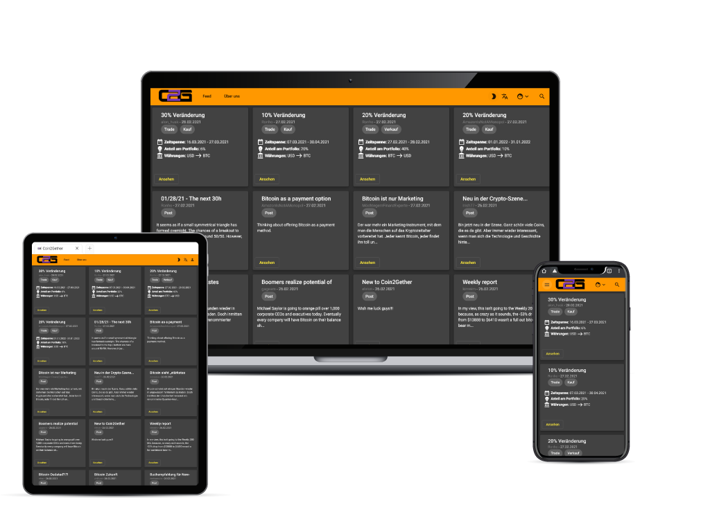
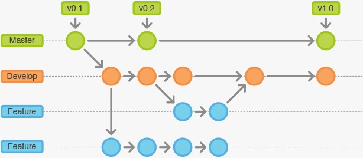

# Dokumentation "Price Predictor"


## Benutzung

Um das Projekt lokal auszuführen, muss vorher node.js installiert werden. Es kann direkt von der [nodejs-Website](https://nodejs.org/en/download/) heruntergeladen werden.
Beim ersten Start des Projektes müssen vorher einige Pakete installiert werden. Dazu muss in dem Ordner "frontend" folgender Code ausgeführt werden.

```bash
npm install
```

Im Anschluss daran, kann das Projekt gestartet werden. Dazu muss, wieder im Ordner "frontend" folgender Code ausgeführt werden.

```bash
npm run en
```


## Inhaltsverzeichnis

- [Benutzung](#Benutzung)
- [Einführung](#Einführung)
- [Coin-2-Gether](#Coin-2-Gether)
- [Aufbau](#Aufbau)
- [Funktion und Datenstruktur](#function)
- [Business](#Business)
	- [Businessplan](#Businessplan)
	- [Geschäftspräsentation](#Geschäftspräsentation)
	- [Business-Model-Canvas](#Business-Model-Canvas)
	- [Value-Proposition-Canvas](#Value-Proposition-Canvas)
	- [Video](#Video)
- [Team](#Team)
- [Technologien](#Technologien)
- [Umsetzung](#Umsetzung)
- [Kritik](#Kritik)
- [Learnings](#Learnings)


## Einführung

Kryptowährungen sind spätestens seit dem Bitcoin-Hype in aller Munde.

Auch eher skeptisch oder konservativ eingestellte Personen werden zunehmend von den Kryptowährungen angezogen. Hinzu kommen auch milliardenschwere Konzerne wie Tesla, die Unmengen an Geld in Kryptowährungen investieren.

Für viele ist die Technik und das Prinzip dahinter jedoch noch sehr fern und schwer verständlich und kaum ein Feld ist unter den Experten so umstritten wie die Kryptobranche. Zudem nimmt der Schwierigkeitsgrad der Einstiegshürde mit der steigenden Anzahl an Krypto-Brokern zu. Wie findet man nun den perfekten Einstieg?

Wir haben eine Plattform für jeden Kryptoliebhaber geschaffen, auf der verschiedenste Informationen und News, sowie Investmentempfehlungen bereitgestellt werden. Über Coin2gether kann man auch automatisch sein Depot managen lassen.

[Inhaltsverzeichnis](#Inhaltsverzeichnis)

## Coin-2-Gether

Mit verschiedenen Herangehensweisen und Zielen, welche sich individuell einstellen lassen, bieten wir eine Lösung für jedermann. Über sichere Altersvorsorge und eine solide jährliche Rendite, bis hin zum reinen Spekulieren und kurzfristigen Daytrading ist alles möglich.

Unsere Empfehlungen und Prognosen erhalten wir von unabhängigen Krypto Experten aus der Szene. Diese werden in unserem Feed bereitgestellt. Des weiteren werden wir Eckdaten zu kurzfristigen Trades veröffentlichen auf Basis der zur Verfügung stehenden Informationen der Krypto Experten.

Neue Trends und Entwicklungen versuchen wir somit früh genug zu identifizieren und unseren Usern weiter zu geben.

[Inhaltsverzeichnis](#Inhaltsverzeichnis)


## Aufbau



[Inhaltsverzeichnis](#Inhaltsverzeichnis)


<a name="function"></a>
## Funktion und Datenstruktur

Nachfolgend ist ein Ablaufdiagramm abgebildet, welches den Prozess eines neuen Trades zeigt.



Zudem das ER-Modell unserer Datenstruktur:



[Inhaltsverzeichnis](#Inhaltsverzeichnis)


## Business

Nachfolgende Links zeigen tiefgehendere Informationen zu unserem Businessmodell

### Businessplan
- [Businessplan](business/businessplan.md)

### Geschäftspräsentation
- [Geschäftspräsentation](business/Masterslide.pptx)

### Business-Model-Canvas


### Value-Proposition-Canvas


### Video

[](https://www.youtube.com/watch?v=vgI1jMHJQTM&feature=youtu.be)

[Inhaltsverzeichnis](#Inhaltsverzeichnis)


## Team

- [Ron Holzapfel](https://github.com/Ronho)
- [Bastian Berle](https://github.com/Irish-77)
- [Ferdinand Muth](https://github.com/pfeeerdi)
- [Jonas Wuttke](https://github.com/jonaswuttke)
- [Tomke Blach](https://github.com/tomkeblach)
- [Fabian Heidger](https://github.com/FHeidger)

[Inhaltsverzeichnis](#Inhaltsverzeichnis)

## Technologien


<br />


Coin2gether ist es sehr wichtig, den latest Shit als Technologie zu verwenden. Wie bereits beschrieben, ist der Markt für Crypto-Trades am boomen, weshalb es uns sehr wichtig ist, dass die von uns ausgewählte Technologie auch skalierbar auf Enterpriseebene ist. Unter diesen Voraussetzungen haben wir uns für Angular als Frontend-Framework und Flask als Backend-Framework entschiedenen. Beide Frameworks sind in ihrem jeweiligen Gebiet das State-of-the-Art und in der Community sehr beliebt. Sowohl Backend, als auch Frontend werden auf einer AWS-Instanz gehostet. Über eine CI/CD-Pipeline werden Änderungen sofort in die Produktion-Umgebung übernommen und können intensiven UATs unterzogen. Natürlich wurden alle möglichen Sicherheitsvorkehrungen für die Instanz innerhalb AWS getroffen. Die Kommunikation zwischen Frontend und Backend läuft über eine tokenbasierte RESTful-API. Das Design basiert auf Material-Komponenten, da diese unserer Meinung nach die auf dem Markt ausgereiftesten und best-getesteten sind. Jedoch haben wir uns bei den Diagrammen für die Google-Charts entschieden. Grund dafür ist, dass man diese Charts einfach frei konfigurieren und designen kann. Die Daten werden in einer relationalen Datenbank gespeichert, die in AWS liegen. Die Wahl einer relationalen Datenbank ist vorerst temporär. In der nahen Zukunft sollten und werden wir aber auf eine No-SQL-Datenbank wechseln, um das Businessmodel um den datengetriebenen Ansatz zu erweitern.

Wichtig war uns zum einen, dass die Seite responsiv ist, sodass sie von allen Endgeräten aufgerufen kann. Egal ob zuhause am PC oder unterwegs vom Handy, alle Inhalte sind perfekt dargestellt.

Zudem haben wir einen Dark Mode inkludiert, um immer den neuesten Trends zu entsprechen.

<div>


</div>



[Inhaltsverzeichnis](#Inhaltsverzeichnis)

## Umsetzung

Jeder aus unserem Team hat sein spezifisches Aufgabengebiet gehabt.

[Ferdinand Muth](https://github.com/pfeeerdi) hat das Backend als Aufgabe. Dementsprechend übernimmt er die Wartung unserer AWS-Instanz, die Programmierung der Datenbasis und der damit verbundenen API-Schnittstelle, sowie der CI/CD-Pipeline, um unsere Development-Umgebung in die Produktionsumgebung zu überführen.

[Ron Holzapfel](https://github.com/Ronho) und [Bastian Berle](https://github.com/Irish-77) vereinen das Backend mit dem Frontend und kümmern sich um die datengetriebenen Inhalte unseres Projektes. Dabei hatten beide ihre speziellen Gebiete wie Authentifizierung, Blogfeed und Blogpost oder die Profilseite mit den Charts. Zudem übernehmen Ron und Bastian die Führung des Projektes wie die Leitung der Meetings und der Aufgabenkontrolle.

[Fabian Heidger](https://github.com/FHeidger) ist hauptsächlich im Frontend unterwegs und betreut die datenungetriebenene Inhalte des Projektes. Zudem arbeitet er gegen Ende hin an der Dokumentation mit und dient als Springer.

[Jonas Wuttke](https://github.com/jonaswuttke) ist unser Business- und Designmanager. Er erstellte unser Designentwurf und kümmmert sich um alle Businessangelegenheiten wie das Business-Model-Canvas oder zuletzt unser Werbevideo.

[Tomke Blach](https://github.com/tomkeblach) dient als Springer und unterstützt alle anderen Mitglieder in ihren Bereichen. So arbeitet er mit im Frontend, liefert Inhalte oder unterstützt Jonas beim Werbevideo.

Unserem Team war ein gemeinsames Arbeiten sehr wichtig. So haben wir ein wöchentliches Meeting, wo wir alle angesammelten Themen besprechen. Dementsprechen werden zuerst alle erledigten Aufgaben geprüft und als erledigt markiert. Im weiteren Schritt offene Fragen geklärt und zuletzt die Aufgaben bis zum nächsten Meeting verteilt.

Zur Planung und Übersichtlichkeit haben wir mit den Möglichkeiten von GitHub gearbeitet. So war unser wichtigstes Arbeitsmittel das von GitHub integrierte KANBAN-Board, wo wir alle Aufgaben in verschiedene Listen wie geplant, in Arbeit, Review und Done eingeteilt haben. Dies diente dazu, dass wir jederzeit über eine Übersicht der aktuellen Todos verfügt haben.

Zudem haben wir Issues benutzt, um direkte Probleme und Bugs einzelnenen Teammitgliedern und Gruppen zuzuweisen.



Ein wichtiger Punkt in der Programmierung war die Arbeit mit Branches in GitHub. Dementsprechen haben wir einige Features ausgelagert und nach fertiger Überprüfung wieder mit dem Develop-Branch gemerged. Dies diente dazu, dass die einzelnen Mitglieder unabhängig voneinander arbeiten konnten.

In den letzten Wochen und Tagen haben wir uns zweimal die Woche in einem Meeting getroffen, um schneller auf Fragen und Probleme reagieren zu können. 

[Inhaltsverzeichnis](#Inhaltsverzeichnis)

## Kritik

- Die Vollständigkeit bei Meetings hätte teilweise besser sein können
- Die Dokumentation hätte von Anfang an stärker in den Fokus rücken müssen (Gerade im Hinblick auf Funktionsweisen und Datenstrukturen)
- Für die Zukunft sollte nicht weiterhin Whatsapp als Channel verwendet werden, da hier keine ausreichende Übersicht geboten wird

[Inhaltsverzeichnis](#Inhaltsverzeichnis)

## Learnings

Durch die Arbeit im Team und die Verwendung neuer und unbekannter Technologien haben wir auch einige Punkte als Learnings mitgenommen.

- Bei neuen Technologien ist Vorsicht geboten. Fehler können sehr schnell passieren und mitunter gravierende Folgen haben
- Testen ist das A und O! (intensive UATs)
- Fremdbibliotheken sind nicht immer so gut wie man denkt
- Auch bei Standardbibliotheken kann man vorsichtig sein (bspw. war die Nutzung von MatGridList als Komponente nicht zu empfehlen, sodass wir auf die Flex-Komponente umgestiegen sind, um die Applikation responsive zu gestalten)
- Die Kommunikation im Team lief mit Verlauf des Projektes immer besser
- lieber ein Commit zu viel, als ein Commit zu wenig
- häufiger ist es besser Komponenten selber zu entwickeln, als bereits existierende Packages dafür zu nutzen. Beispiel: Suchleiste

[Inhaltsverzeichnis](#Inhaltsverzeichnis)


<!--
## **Guidelines for Dvlprs**

#### Coding
- follow guidelines of Uncle Bob's [Clean Code](http://blog.cleancoder.com/)

[Inhaltsverzeichnis](#Inhaltsverzeichnis)

#### Commiting Rules
- translation for an element: ```added translations lang={ de/en/all } for { element }```
    > added translations lang=de for signin
- typos: ```"fixed typos in <destination>"```
- connect frontend with backend: ```connect fronend w/ backend => { element }```

[Inhaltsverzeichnis](#Inhaltsverzeichnis)

#### Branch System
 -->


