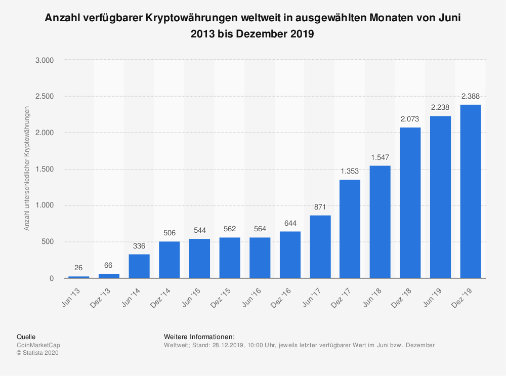
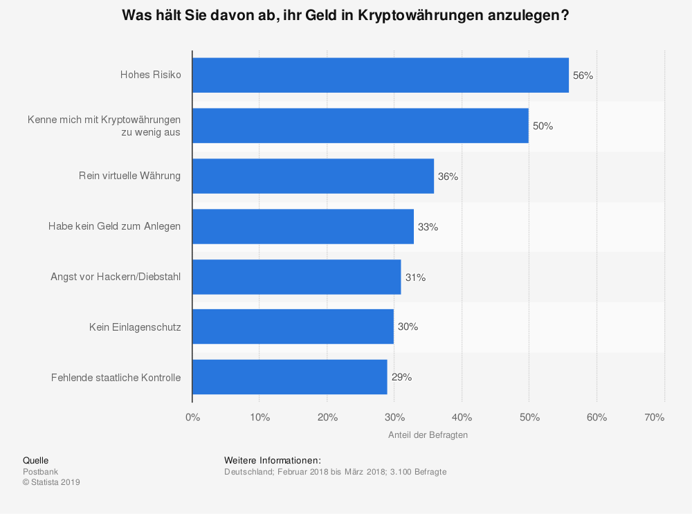
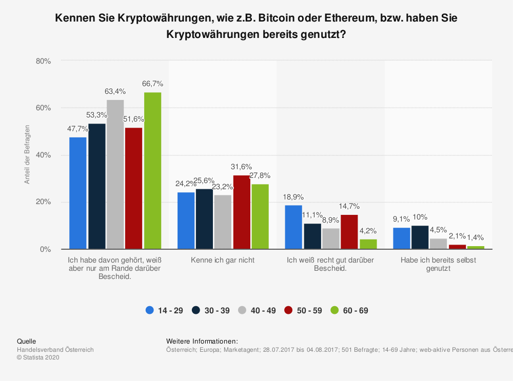
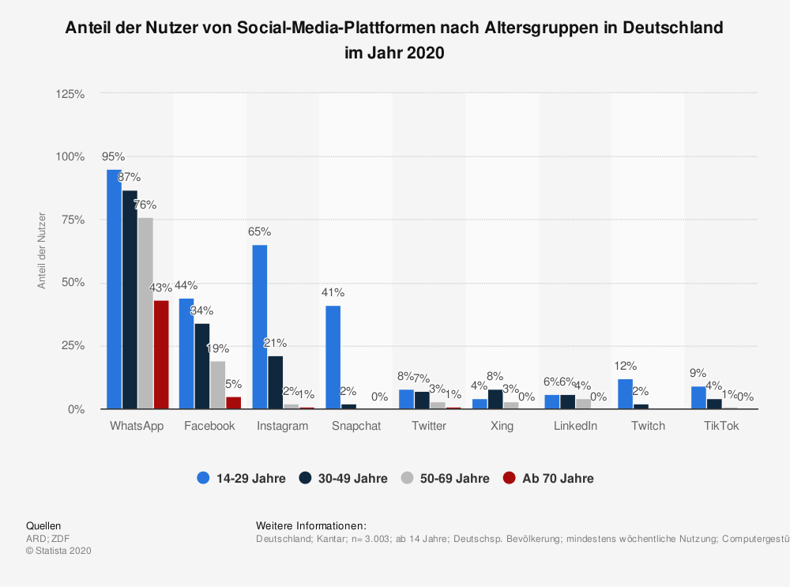

# Businessplan Coin2gether

## Inhaltsverzeichnis

- [Einführung](#Einführung)
- [Geschäftsmodell](#Geschäftsmodell)
- [Technologie](#Technologie)
- [Aktuelle Situation](#Aktuelle&nbsp;Situation)
- [Marketing](#Marketing)
- [Team und Arbeitsweise](#Team&nbsp;und&nbsp;Arbeitsweise)
- [Finanzen](#Finanzen)

## Einführung

Kryptowährungen sind spätestens seit dem Bitcoin-Hype in aller Munde.

Auch eher skeptisch oder konservativ eingestellte Personen werden zunehmend von den Kryptowährungen angezogen. Hinzu kommen auch milliardenschwere Konzerne wie Tesla, die Unmengen an Geld in Kryptowährungen investieren.

Für viele ist die Technik und das Prinzip dahinter jedoch noch sehr fern und schwer verständlich und kaum ein Feld ist unter den Experten so umstritten wie die Kryptobranche. Zudem nimmt der Schwierigkeitsgrad der Einstiegshürde mit der steigenden Anzahl an Krypto-Brokern zu. Wie findet man nun den perfekten Einstieg?

Wir haben eine Plattform für jeden Kryptoliebhaber geschaffen, auf der verschiedenste Informationen und News, sowie Investmentempfehlungen bereitgestellt werden. Über Coin2gether kann man auch automatisch sein Depot managen lassen.

Ob Anfänger oder Profi. Bei uns ist jeder, der in die Kryptowelt eintauchen möchte, herzlich willkommen.

## Geschäftsmodell

Jeder soll die Möglichkeit haben mit Kryptowährungen zu handeln.

Mit verschiedenen Herangehensweisen und Zielen, welche sich individuell einstellen lassen, bieten wir eine Lösung für jedermann. Über sichere Altersvorsorge und eine solide jährliche Rendite, bis hin zum reinen Spekulieren und kurzfristigen Daytrading ist alles möglich.

Unsere Empfehlungen und Prognosen erhalten wir von unabhängigen Krypto Experten aus der Szene. Diese werden in unserem Feed bereitgestellt. Des weiteren werden wir Eckdaten zu kurzfristigen Trades veröffentlichen auf Basis der zur Verfügung stehenden Informationen der Krypto Experten.

Neue Trends und Entwicklungen versuchen wir somit früh genug zu identifizieren und unseren Usern weiter zu geben.

## Technologie

Coin2gether ist es sehr wichtig den latest Shit als Technologie zu verwenden. Wie bereits beschrieben, ist der Markt für Crypto-Trades am boomen, weshalb es uns sehr wichtig ist, dass die von uns ausgewählte Technologie auch skalierbar auf Enterpriseebene ist. Unter diesen Voraussetzungen haben wir uns für Angular als Frontend-Framework und Flask als Backend-Framework entschiedenen. Beide Frameworks sind in ihrem jeweiligen Gebiet das State-of-the-Art und in der Community sehr beliebt. Sowohl Backend, als auch Frontend werden auf einer AWS-Instanz gehostet. Über eine CI/CD-Pipeline werden Änderungen sofort in die Produktion-Umgebung übernommen und können intensiven UATs unterzogen. Natürlich wurden alle möglichen Sicherheitsvorkehrungen für die Instanz innerhalb AWS getroffen. Die Kommunikation zwischen Frontend und Backend läuft über eine tokenbasierte RESTful-API. Das Design basiert auf Material-Komponenten, da diese unserer Meinung nach die auf dem Markt ausgereiftesten und best-getesteten sind. Jedoch haben wir uns bei den Diagrammen für die Google-Charts entschieden. Grund dafür ist, dass man diese Charts einfach frei konfigurieren und designen kann. Die Daten werden in einer relationalen Datenbank gespeichert, die in AWS liegen. Die Wahl einer relationalen Datenbank ist vorerst temporär. In der nahen Zukunft sollten und werden wir aber auf eine No-SQL-Datenbank wechseln, um das Businessmodel um den datengetriebenen Ansatz zu erweitern.

## Aktuelle Situation

Das Thema Kryptowährungen wird immer populärer.

Dazu kommen immer mehr und neue Kryptowährungen mit verschiedenen Vor- und Nachteilen. Aus diesen kristallisieren sich aber zunehmend die größten Währungen hervor, wie z.b. Bitcoin, Ethereum, Ripple oder Litecoin.

Darunter gibt es auch „Meme“ Währungen wie Dogecoin, welche nicht zuletzt durch Twitter Posts von Elon Musk oder Wallstreetbets auf Reddit in der Öffentlichkeit aufgefallen sind.

Viele Menschen werden nun mit diesem Thema konfrontiert. Der Großteil davon ist jedoch noch sehr unbelehrt über das Thema und hat verständlicherweise Bedenken, wenn es um das investieren in diese Währungen geht.

Das Risiko und das fehlende „Know-How“ sind für die meisten Leute immer noch der größte Grund nicht in Kryptowährungen zu investieren.

Dieses Problem wollen wir durch Coin2gether beheben oder zumindest lindern und in diesem Zuge mehr Vertrauen und Informationen in diese neue Zukunftstechnologie zu bringen.

## Marketing

Wir wollen uns beim Marketing eher auf die jüngeren Erwachsenen und heranwachsenden konzentrieren. Innerhalb dieser Gruppe findet sich das meiste Interesse zum Thema Kryptowährungen. (Lila+Rot in der Grafik)

Daher werden wir uns hauptsächlich auf Social Media Marketing konzentrieren um unsere Zielgruppe zu erreichen. Der Schwerpunkt liegt dabei auf Instagram. Dort wird eine eigene Präsenz mit Account aufgebaut. Dazu wird Werbung geschaltet und Gewinnspiele veranstaltet. Product Placements bei Finanzkanälen wären auch eine gute Möglichkeit, sowie falls umsetzbar „Ref-Links“.

Mit Facebook könnte man die etwas ältere Generation erreichen. Dies wird aber eher nur nebensächlich berücksichtigt.

Man könnte auch über Snapchat und TikTok Werbung schalten bzw. einen Account aufbauen um die sehr junge Generation zu erreichen.

## Team und Arbeitsweise

Unser Team besteht hauptsächlich aus Frontend, Backend und Business. Jedes Teammitglied hat einen Schwerpunkt Es kommt natürlich auch vor, dass man ein wenig Arbeit in den anderen Bereichen übernimmt, Hilfestellung gibt oder mehrere Teams für eine Aufgabe benötigt werden. Unser Arbeitsweise ist somit Scrum-ähnlich. Warum nicht komplett Scrum? Aus verschiedenen Gründen, u.a. zeitlich, ist ein ganzheitlicher Ansatz nicht umsetzbar gewesen. Ein Sprint dauert bei uns genau eine Woche. In unserem wöchentlichen Talk wurden jedoch alle Events gecovert (Planning, Review, Retroskeptive), d.h. wir haben uns über den Arbeitsfortschritt, jegliche Probleme oder Schwierigkeiten ausgetauscht und anschließend den kommenden Sprint geplant. Um einen Überblick über die Aufgaben zu behalten, haben wir alle Tasks über ein Kanban-Board verwaltet. Bei größeren Problemen wurden zudem ein Issue erstellt, um detailliert und strukturiert Lösungen zu finden. Ein ganz wichtiger Punkt ist unser Branch-System. Die konsequente Durchführung von Feature-orientierten hat es uns ermöglicht, schnell und einfach neue Änderungen zu veröffentlichen.

## Finanzen

Die Hauptkosten werden höchstwahrscheinlich für Werbung und Marketing Kampagnen anfallen. Je nach Bandbreite und Nutzerauslastung können wir mithilfe von AWS skalierbar und individuell auf den Usertraffic eingehen, was die Kosten in dem Bereich Wartung und Infrastruktur etwas variieren lässt. Außerdem kommen dazu noch eventuelle Kosten für API Schnittstellen bei den Krypto Brokern. Die Vergütung der Influencer wird hauptsächlich mit den Einnahmen der Nutzer versucht, da diese sich ihre eigenen Experten aussuchen können. Dies wird durch einfaches Supply & Demand geregelt.
